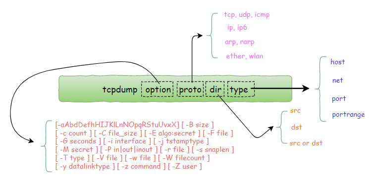
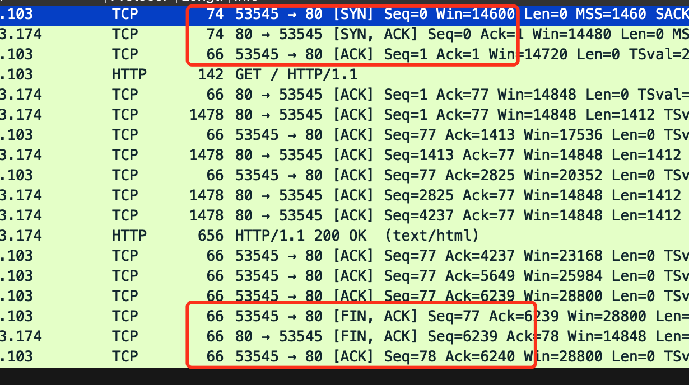
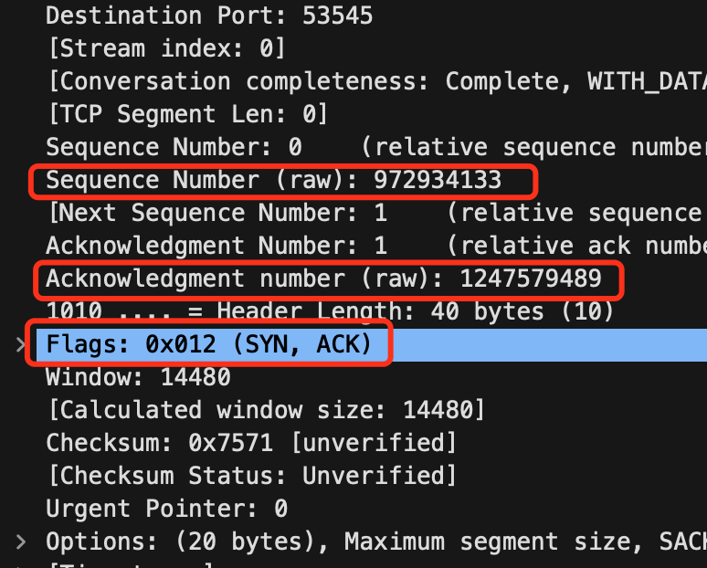

# Tcpdump 命令

## 简介

tcpdump ： dump the traffic on a network，根据使用者的定义对网络上的数据包进行截获的包分析工具。是 linux 强大的网络数据采集分析工具

## 用法

[tcpdump 使用指南](https://www.cnblogs.com/wongbingming/p/13212306.html)

```
tcpdump [-aAbdDefhHIJKlLnNOpqStuUvxX#] [ -B size ] [ -c count ]
        [ -C file_size ] [ -E algo:secret ] [ -F file ] [ -G seconds ]
        [ -i interface ] [ -j tstamptype ] [ -M secret ] [ --number ]
        [ -Q in|out|inout ]
        [ -r file ] [ -s snaplen ] [ --time-stamp-precision precision ]
        [ --immediate-mode ] [ -T type ] [ --version ] [ -V file ]
        [ -w file ] [ -W filecount ] [ -y datalinktype ] [ -z postrotate-command ]
        [ -g ] [ -k (flags) ] [ -o ] [ -P ] [ -Q meta-data-expression ]
        [ --apple-tzo offset ] [--apple-truncate ]
        [ -Z user ] [ expression ]
```

<div align="center"> </img></div>\

功能非常强大，选项特别多，慢慢学习，实际用时再详细了解

## 输出结果

```
# 当前 ip x.xxx.xxx.xxx , 查询 10101 端口占用程序的 tcp 过程 
# 执行命令 tcpdump -i eth1 tcp port 10101
# 下面是 34123 向 10101 请求数据，10101 给 34123 回报文的一部分
......
22:02:56.293977 IP x.xxx.xxx.xxx.10101 > x.xxx.x.xxx.34123: Flags [.], seq 57893:59305, ack 2826, win 501, options [nop,nop,TS val 3041110190 ecr 1822315787], length 1412
22:02:56.293983 IP x.xxx.xxx.xxx.10101 > x.xxx.x.xxx.34123: Flags [.], seq 59305:60717, ack 2826, win 501, options [nop,nop,TS val 3041110190 ecr 1822315787], length 1412
22:02:56.293990 IP x.xxx.xxx.xxx.10101 > x.xxx.x.xxx.34123: Flags [.], seq 60717:62129, ack 2826, win 501, options [nop,nop,TS val 3041110190 ecr 1822315787], length 1412
......
22:02:56.294130 IP x.xxx.x.xxx.34123 > x.xxx.xxx.xxx.10101: Flags [.], ack 57893, win 507, options [nop,nop,TS val 1822315788 ecr 3041110190], length 0
22:02:56.294130 IP x.xxx.x.xxx.34123 > x.xxx.xxx.xxx.10101: Flags [.], ack 59305, win 529, options [nop,nop,TS val 1822315788 ecr 3041110190], length 0
22:02:56.294130 IP x.xxx.x.xxx.34123 > x.xxx.xxx.xxx.10101: Flags [.], ack 60717, win 542, options [nop,nop,TS val 1822315788 ecr 3041110190], length 0
.....
上面过程 去除了 tcp 建立连接和 断开连接的过程，只保留了 10101 回报，和 34123 接受的部分过程。
这里可以看到，返回报文，分包的过程，比如 发包： seq 60717:62129 length 1412  收包：ack 60717 。上面和下面都是对应的。
```
- 时间
- 协议
- client ip + 端口
- 服务端 ip + 端口
- 冒号后： 数据包内容，上面命令只保留了 tcp 协议，所以是 tcp 头的信息

## 常用过滤规则

- `host`: 过滤 ip `tcpdump host x.xxx.xxx.xxx`
- `src/dst`: 区分源/目标 ip `tcpdump [src/dst] x.xxx.xxx.xxx`
- `net`: 网段过滤 `tcpdump net x.xxx.xxx.0/99` 、 `tcpdump [src/dst] net  x.xx.xxx`
- `port`: 端口过滤 `tcpdump [src/dst] port 80 [or 8080]` 可选多端口
- `portrang`: 范围端口过滤 `tcpdump [src/dst] portrang 8000-8080` 可选多端口
- `tcp`: 过滤协议 `tcpdump tcp` 包括 tcp, udp, icmp, http, ip 等
- `proto`: 过滤协议版本 `tcpdump tcp proto 4` 4、6 指 ipv4 ipv6
- 规则组合
  - and: 逻辑与 && `tcpdump host xx.xx.xx.xx and port 8080`
  - or: 逻辑或 || `tcpdump port 80 or port 443`
  - not: 逻辑非 !

## 常用参数

- `-i`: 过滤网卡接口 `tcpdump -i eth1`
- `-w`: 将结果写入文件 `tcpdump -i eth1 -w dump.pcap`
- `-r`: 读文件然后过滤 `tcpdump tcp -r dump.pcap`

## wireshark

- 抓包后的.pcap 文件可以用 wireshark 打开，可以看到详细数据
- 打开文件截图: [为啥挥手是 3 次](https://xiaolincoding.com/network/3_tcp/tcp_three_fin.html#_4-22-tcp-%E5%9B%9B%E6%AC%A1%E6%8C%A5%E6%89%8B-%E5%8F%AF%E4%BB%A5%E5%8F%98%E6%88%90%E4%B8%89%E6%AC%A1%E5%90%97)

<div align="center"> </img></div>

- 三次握手的第二次握手，server 回包，把收到的 seq+1 放到 ack，再自己的 isn 放到 seq。标志位只为 SYN +

<div align="center"> </img></div>
