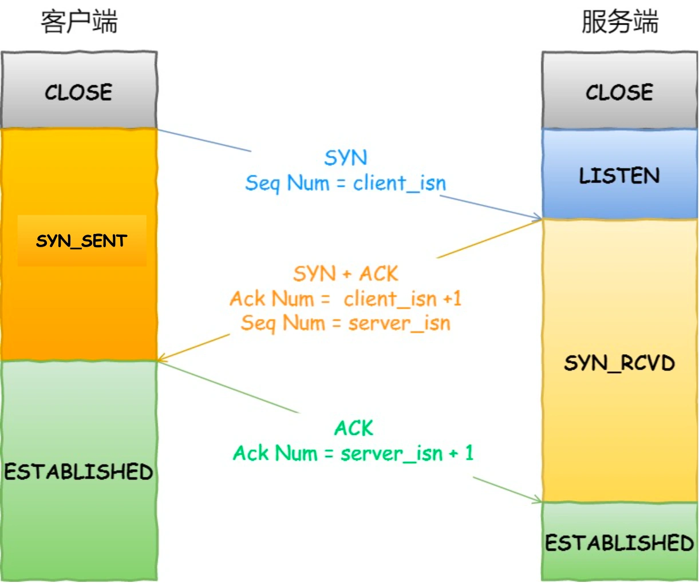
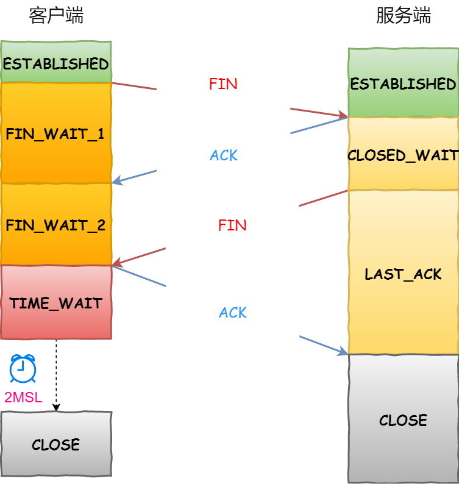

# Tcp

> TCP 是面向连接的、可靠的、基于字节流的传输层通信协议。[Tcp 知识点](https://xiaolincoding.com/network/3_tcp/tcp_interview.html)

## 基础

- 位置：属于**传输层**协议（应用层、传输层、网络层、网络接口层）
- 特点
  - 面向连接： 1 对 1 链接
  - 可靠：完整链路保证传输
  - 字节流：报文传输
- 四元组：四元组确立一个唯一 TCP 链接：源地址+源端口+目的地址+目的端口
- 理论最大链接数：ip 数*端口数（2^32*2^16=2^48）
  - 受内存限制
  - 受文件描述符限制 to many open files
- 查看链接命令: `netstat -napt`
- tcp 头
  - 序列号：本端序列号，client_isn 或者 server_isn
  - 确认应答号：期望收到的序列号，对方序列号+1 ；例如第二次握手 server 给 client 回包（seq:server_isn;ack:client_isn+1）
  - data：前 2 次握手不会有 data，第三次可带 data
  - 控制位：
    - SYN: 1 希望建立连接
    - ACK: 1 确认应答
    - RST: 1 异常，强制断开
    - FIN: 1 结束，希望断开
  ```
  0                   1                   2                   3
  0 1 2 3 4 5 6 7 8 9 0 1 2 3 4 5 6 7 8 9 0 1 2 3 4 5 6 7 8 9 0 1
  +-+-+-+-+-+-+-+-+-+-+-+-+-+-+-+-+-+-+-+-+-+-+-+-+-+-+-+-+-+-+-+-+
  |          Source Port          |       Destination Port        |
  +-+-+-+-+-+-+-+-+-+-+-+-+-+-+-+-+-+-+-+-+-+-+-+-+-+-+-+-+-+-+-+-+
  |                        Sequence Number  (序列号)               |
  +-+-+-+-+-+-+-+-+-+-+-+-+-+-+-+-+-+-+-+-+-+-+-+-+-+-+-+-+-+-+-+-+
  |                    Acknowledgment Number (确认应答号）          |
  +-+-+-+-+-+-+-+-+-+-+-+-+-+-+-+-+-+-+-+-+-+-+-+-+-+-+-+-+-+-+-+-+
  |  Data |       |C|E|U|A|P|R|S|F|                               |
  | Offset|  Res. |W|C|R|C|S|S|Y|I|            Window             |
  |       |       |R|E|G|K|H|T|N|N|                               |
  +-+-+-+-+-+-+-+-+-+-+-+-+-+-+-+-+-+-+-+-+-+-+-+-+-+-+-+-+-+-+-+-+
  |           Checksum            |         Urgent Pointer        |
  +-+-+-+-+-+-+-+-+-+-+-+-+-+-+-+-+-+-+-+-+-+-+-+-+-+-+-+-+-+-+-+-+
  |                    Options                    |    Padding    |
  +-+-+-+-+-+-+-+-+-+-+-+-+-+-+-+-+-+-+-+-+-+-+-+-+-+-+-+-+-+-+-+-+
  |                             data                              |
  +-+-+-+-+-+-+-+-+-+-+-+-+-+-+-+-+-+-+-+-+-+-+-+-+-+-+-+-+-+-+-+-+
  ```

## 建立连接

- 状态
  - client: CLOSE -> SYN_SENT -> ESTABLISHED
  - server: CLOSE -> LISTEN -> SYN_RCVD -> ESTABLISHED
- 过程

  <div align="center"> </img></div>

  - 初始态：client、server 都是 CLOSE。 server 监听端口，处于 LISTEN
  - client：其他信息+序号(client_ISN)+ [ SYN=1 ] 组成报文发送到 server ， 并修改状态成 SYN_SENT
  - server: 其他信息+序号(server_ISN)+ [ 序号(client_ISN)+1) ] + [ SYN=1 ] + [ ACK=1 ] 组成报文发送到 client，并修改状态成 SYN_RCVD
  - client：其他信息+[ 序号(server_ISN)+1 ]+[ ACK=1 ] +可带数据 组成报文发送给 server , 修改状态成 ESTABLISHED
  - server: 收到信息，修改状态成 ESTABLISHED

- 异常
  - 网络堵塞：导致 client 收到的 server 序列号预期（100+1），和实际收到的 server 序列号预期（99+1）。 client 会回[ RST=1 ]给 sever ，状态修改成 CLOSE ，server 状态修改为 LISTEN
  - 第一次握手 SYN 丢了，会发生什么？
    - 会重传，序列号一致。
    - 默认 5 次；内核参数`/proc/sys/net/ipv4/tcp_syn_retries`控制
    - 每次 RTO 时间 2 的指数级增加（1，2，4，8，16）第一次 1 秒
    - 超过 5 次，状态修改为 CLOSE
  - 第二次握手 SYN+ACK 丢了，会发生什么？
    - 类似会重传
    - 默认 5 次；内核参数`/proc/sys/net/ipv4/tcp_synack_retries`控制
  - 第三次握手 ACK 丢了，会发生什么？
    - client 发出 ACK 后，处于 ESTABLISHED。server 会继续 重传 SYN + ACK 包，直到最大次数，默认 5
  - client 处于 ESTABLISHED ，server 处于 CLOSE ，client 怎么发现？并断开
    - 如果 client 发送数据，server 没用响应，会触发重传，默认 15 次，内核参数`/proc/sys/net/ipv4/tcp_retries2`控制
    - 如果 client 不发生数据，需要用到保活机制。默认需要 `7200+75*9` 秒 ，2 小时 11 分 15 秒 才能发现服务器已经断开
      ```
      net.ipv4.tcp_keepalive_time=7200
      net.ipv4.tcp_keepalive_intvl=75
      net.ipv4.tcp_keepalive_probes=9
      ```

## 断开连接

- 状态
  - client: ESTABLISHED -> FIN_WAIT_1 -> FIN_WAIT_2 -> TIME_WAIT -> CLOSE
  - server: ESTABLISHED -> CLOSE_WAIT -> LAST_ACK -> CLOSE
- 过程

  <div align="center"> </img></div>

  - 初始态：client、server 都是 ESTABLISHED
  - client: 希望断开连接，其他信息+[ FIN=1 ]组成报文发送到 server，状态修改为 FIN_WAIT_1
  - server: 同意断开，其他信息+[ ACK=1 ] 组成报文发送到 client，状态修改为 CLOST_WAIT
  - client: 收到 [ ACK=1 ] ,状态修改为 FIN_WAIT_2
  - server: 处理完最后一个包后，其他信息+[ FIN=1 ]组成报文发送到 client，状态修改为 LAST_ACK
  - client: 收到后，其他信息+[ ACK=1 ]组成报文发送到 server，状态修改为 TIME_WAIT
  - server: 收到后，状态修改为 CLOSE
  - client: 主动断开场景，2msl 后状态修改为 CLOSE

- 疑问？？？

  - 为啥断开需要 4 次，建立仅需要 3 次
    - 建立连接是 2 次 SYN+2 次 ACK；断开连接是 2 次 FIN+2 次 ACK。
    - 建立连接第二次握手，把 SYN+ACK 合并发送到 client。断开连接时，因为 server 收到 FIN 时可能还有未处理的包，所以不能合并，需要先发送 FIN，处理完最后一个包再发送 ACK

- 异常
  - 第一次挥手丢包，会发生什么？
    - client 收不到 server 的 ACK ，就会重传 FIn ，直到最大次数，后自动转为 CLOSE
    - 由`tcp_orphan_retries`控制
  - 第二次挥手丢包，会发生什么？
    - client 收不到 server 的 ACK ，就会重传 FIn ，直到最大次数，后自动转为 CLOSE
    - 由`tcp_orphan_retries`控制
    - 跟第一次一样，server 没收到 FIN 和 client 没有收到 ACK，对客户端来讲都是一样的
  - 第三次挥手丢包，会发生什么？
    - server 收不到 client 的 ACK ，就会重传 FIn ，直到最大次数，后自动转为 CLOSE
    - 还是由`tcp_orphan_retries`控制
    - client 收不到 server 的 FIN， 超时 `tcp_fin_timeout`后，自动转为 CLOSE
  - 第四次挥手丢包，会发生什么？
    - server 一直收不到 ACK ，就会重传 FIN，直到最大次数，后自动断开连接
