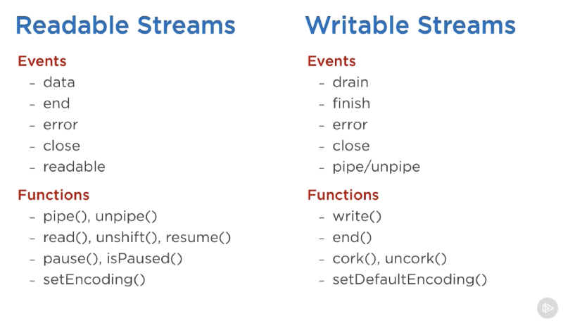

# Buffer & Stream

## 1、Buffer

### Buffer 是啥

- Buffer 是固定长度的字节序列， 可以理解为固定长度二进制数组，是 [Uint8Array](https://developer.mozilla.org/en-US/docs/Web/JavaScript/Reference/Global_Objects/Uint8Array) 的子类

### Buffer 应用场景

- 处理文件：`readFile('path',(err,data)=>{ data })` 默认返回的就是一个 Buffer 对象
- 接受前端传入的文件：`req.on('data',(chunk)=>{ chunk })` 接收的 chunk 也是一个 Buffer 对象

### Buffer Api

- `Buffer.alloc` 创建指定长度对象
- `Buffer.from` 创建固定长度对象
- `buf.toString` 输出对应编码的字符串，`ut-8`,`hex`,`base64` 等
- `buf.fill` 指定 from end 填充二进制 ，支持字符串，数字。会按照 ASCII 表转换后存入二进制数字。 超过长度报错
- `buf.write` 指定 from length 填充二进制，只支持字符串。超过长度报错
- `Buffer.concat` 返回新 Buffer
- 类数组操作：for 遍历，...解构，索引[n]
- 字符串格式转换(base64->utf-8): `Buffer.from(str,'base64')`, `buf.toString('utf-8')`

## 2、Stream

[Node.js Streams: Everything you need to know](https://www.freecodecamp.org/news/node-js-streams-everything-you-need-to-know-c9141306be93)

### stream 是啥？

- stream 是一种处理数据的抽象接口
- stream 不能直接使用，需要通过基类派生子类，并实现了相应的接口，才能使用子类
- 所有 stream 都继承了`EventEmmitter`

### stream 场景

- 一般都是 I/0 操作

  - 处理文件
  - 网络

- 为什么这些场景需要 stream

  - I/O 操作都是端-端的操作，如果按照常规操作，需要将一端数据加载到内存，然后内存写到另一端
  - 如果数据量较大就会极大占用内存，效率太低
  - stream 的思想是将一端数据,切成一个个指定大小的 `chunk`，加载到内存，然后把 chunk 写到另一端
  - 占有内存较少，”流动"的方式，一边读，一边写 极大提升处理效率

### nodejs 提供的 stream 对象

- Http requests response
- fs createReadStream createWriteStream
- zlib streams
- crypto streams
- Tcp sockets
- Process stdin stdout stderr

### stream 类型

- Writable : 可写流
- Readbale : 可读流
- Dulex : 双工流（可读，可写）
- Transform : 转换流

  下图 stream 相关的一些常用事件和方法

<div align="center"> </img></div>

- 流都是从可读流开始的，如何启动可读流？
  - 添加'data'事件句柄
  - stream.resume()
  - stream.pipe()

### pipe & pipeline

- pipe 属于对象： Readbale 有 pipe 方法， Writable 可以监听 pipe 事件
- pipeline 属于类 ：将 Readbale 和 Writable 链接起来 `pipeline(rStream,wStream)`

### 处理流异常情况

- `error`： 给可读流和可写流都添加`error`事件句柄
- `pipeline`： pipeline 添加回调函数参数

  ```
  pipeline(
    fs.createReadStream('archive.tar'),
    zlib.createGzip(),
    fs.createWriteStream('archive.tar.gz'),
    (err) => {
      if (err) {
        console.error('Pipeline failed.', err);
      } else {
        console.log('Pipeline succeeded.');
      }
    }
  );
  ```

### 实现流，通过继承基类，实现自定义功能流

- 实现可写流
  ```
  const { Writable } = require('node:stream');
  const myWritable = new Writable({
    write(chunk, encoding, callback) {
      // ...
    }
  });
  ```
- 实现可读流
  ```
  const { Readable } = require('node:stream');
  const myReadable = new Readable({
    read(size) {
      // ...
    }
  });
  ```
- 实现双工流
  ```
  const { Duplex } = require('node:stream');
  const myDuplex = new Duplex({
    read(size) {
      // ...
    },
    write(chunk, encoding, callback) {
      // ...
    }
  });
  ```
- 实现转换流
  ```
  const { Transform } = require('node:stream');
  const myTransform = new Transform({
    transform(chunk, encoding, callback) {
      // ...
    }
  });
  ```
