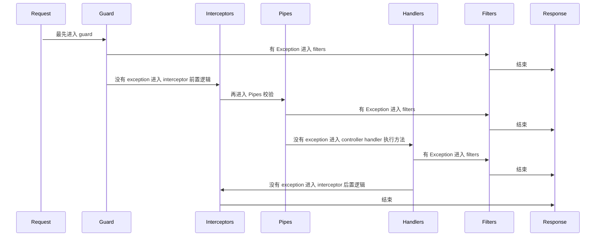

# 第一阶段总结

> 学习了 nest 第一阶段的总结，主要围绕 Module Controller Provider Aop 等基础功能。

## Module

- `module` 是 nest 架构的基本组成单元 ， 从 `appModule` 开始构建 `依赖图` 数据结构
- `import & export ` 可以是的模块之间的 `provider` 可以相互引用 。注意循环依赖。
- `@Global()` 标注全局模块，不需要引入也可以直接使用
- `dynamic module`  通过函数返回不固定的 `module` 达到定制化的效果
- `lazyLoad module` 懒加载模块，在程序运行中，指定加载时机
- `moduleRef` 提供了一个不需要注入的访问 `provider` 的方法 , **仅仅在当前 `module` `context` 下**

## Controller

- `路由` 通过装饰器来标注接收请求的 `url` ，`method`。 注意不要重复
- `装饰器` nest 提供了很多装饰器，需要全部掌握
    - `输入` : `@Request @Query @Param @Body`
    - `输出` : `@Response @Header @HttpCode @Redirect`
    - `自定义` : `@Cookies @User` 等，需要创建
- `request & response` : 很关键的对象，都继承于 `Stream` 都继承于 `EventEmitter`
- `添加切片` : 可以给指定的路由添加 4 个 Aop 切片

## Provider

- `IOC 容器`  所有的 provider 需要通过 `@Injectable()` 标注，进而被 IOC 容器收集管理
- `service` 最常见的场景，作为一个业务操作集合
- `Custom Provider` 自定义 provider 有 4 种 `ClassProvider` , `ValueProvider` , `FactoryProvider` ，`ExistingProvider`
- `FactoryProvider` 通过函数或者异步函数来返回 provider 对象，提供了极大的可编程性。
- `Provider Token` 用来标记全局唯一 `provider` ，可以通过注入获取，或者通过 `moduleRef` 获取
- `全局单例` provider 默认是全局单例。可以通过 `scope` 设置 request 级别单例，或者每次都是新实例 ；会影响性能，谨慎使用

## Aop 

- `Exception Filters` : 用于拦截异常后更友好的返回数据。 
    - 用 `@Catch()` 标注，实现 `ExceptionFilter` 接口，使用 `@UseFilters()` 添加
    - 应用场景： 错误码统一翻译
- `Pipe` : 用于校验或者加工 controller 之前的参数。
    - 用 `@Injectable()` 标注，实现 `PipeTransform` 接口，使用 `@UsePipes()` 添加
    - 应用场景：接口入参校验
- `Guards` : 一般用于校验 `cookie` , `header` 等来判断身份
    - 用 `@Injectable()` 标注，实现 `CanActivate` 接口，使用 `@UseGuards()` 添加
    - 应用场景：登录态校验
- `Interceptors` : 包含前置逻辑，后置逻辑 用于前后拦截，做必要业务。
    - 用 `@Injectable()` 标注，实现 `NestInterceptor` 接口，使用 `@UseGuards()` 添加
    - 应用场景：tracer , 日志，数据包装 等。

**执行顺序如下：**

- `ExecutionContext` : 执行上下文，获取当前执行环境，区分 http websocket microservice

## Nest 内置的特殊 class 

> 通过注入 nest 内置的 class 来处理特定场景的功能

- `Reflector` : 用于获取自定义装饰器内容
- `ModuleRef` : 用于获取 provider 
- `LazyModuleLoader` : 用于加载模块

## 备注

- [Nest Module](./Nest_Module.md)
- [Nest Controller](./Nest_Controller.md)
- [Nest Provider](./Nest_Provider.md)
- [Nest Aop 切片](./Nest_Aop.md)
- [Nest Fundamentals](./Nest_Fundamentals.md)