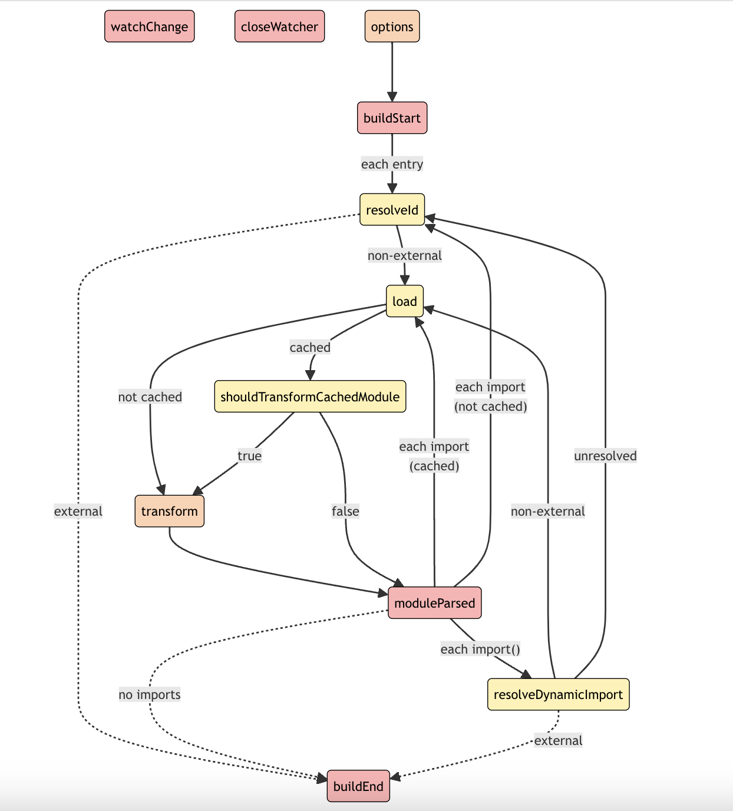
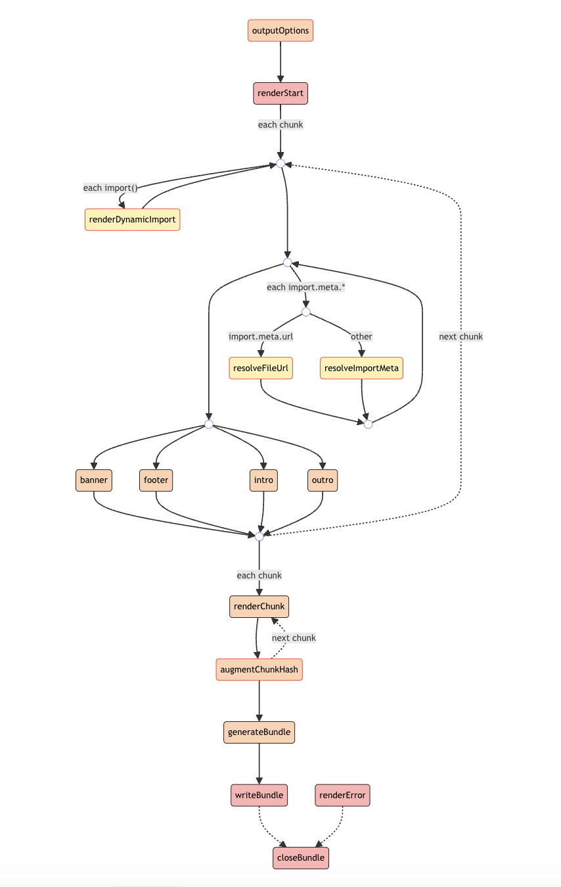

# Vite - plugin 

> vite 备受欢迎的其中一个很重要的特点就是开箱即用，基本不用什么配置就可以构建最常见的web开发模式。 但是在一些少见场景或者特色场景需要我们使用插件来扩展功能。

## 查找插件

- 官方插件: 
  - `@vitejs/plugin-vue` : vue3
  - `@vitejs/plugin-vue-jsx` : vue3 jsx
  - `@vitejs/plugin-vue2` : vue 2
  - `@vitejs/plugin-vue2-jsx` : vue 2 jsx
  - `@vitejs/plugin-react` : react
  - `@vitejs/plugin-react-swc` : react swc 替换 babel
  - `@vitejs/plugin-legacy` : 浏览器 es module polyfill
- 社区插件:
  - [awesome-vite#plugins](https://github.com/vitejs/awesome-vite#plugins)
- rollup插件: 大多数rollup插件也是适用 vite 的
- 常用插件
  - `vite-bundle-visualizer` : 包分析
  - `unplugin-vue-components` :  无需 import 组件
  - `unplugin-auto-import` : 无需 import  vue react 等 api
  - `vite-plugin-html` : 专门处理 html 的插件，一般用于替换，注入 指定内容等
  - `vite-plugin-zip-pack` : 打包成 zip 文件
  - `vite-plugin-inspect` : 分析其他插件的状态

## 使用插件

- 添加插件 ： `install` 并在 `vite.config.js` 的 `plugins` 中添加即可
```ts
plugins: [
  vitePluginXxx(),    // 插件返回的是一个对象。
],
```
- 调整执行顺序 : 有的时候，插件没有效果，是因为执行顺序不对。 扩展插件对象的 `enforce` 属性调整执行顺序
```ts
{
  ...vitePluginXxx(),
  enforce : 'pre'
},
```
  - `pre`: 在 Vite `核心插件`之前调用该插件
  - 默认: 在 Vite `核心插件`之后调用该插件  
  - `post`: 在 Vite `构建插件`之后调用该插件
  
```
// 具体的插件执行顺序
* Plugin invocation order:
* - alias resolution            // alias 插件
* - `enforce: 'pre'` plugins    // enforce:pre 插件
* - vite core plugins           // vite 核心插件
* - normal plugins              // normal 插件，没有enforce值
* - vite build plugins          // 构建插件
* - `enforce: 'post'` plugins   // enforce:post 插件
* - vite build post plugins     // 构建特有插件
```

- 按需应用 : 配置 `apply`参数指定插件应用模式  ` apply: 'serve'|'build'`  开发｜构建

## 自定义插件

vite 提供了很多钩子，我们只要重写钩子函数就可以明白钩子函数的作用，然后根据自己实际需求进行修改。

这里可以定义一个插件，监听所有钩子函数。

```ts
const MyPlugin = () => {
  return {
    name: 'My-plugin',
    config: (config, env) => {
      console.log('config:', config, env);
    },
    configResolved(resolvedConfig) {
      console.log('resolvedConfig:', resolvedConfig.plugins);
    },
    options: (info) => {
      console.log('options:', info);
    },
    buildStart: (info) => {
      console.log('buildStart:', info);
    },
    load: (id, options) => {
      console.log('load:', id, options);
    },
    transform: (src, id) => {
      console.log('transform:', id);
    },
    resolveId: (source, importer, options) => {
      console.log('resolveId:', source, importer, options);
      // 处理自定义模块，或者有 alias 的模块
    },
    transformIndexHtml(html) {
      console.log('html:', html);
    },
    configureServer(server) {
      console.log('configureServer:', server.middlewares);
      // dev server
    },
    handleHotUpdate({ server, modules }) {
      for (const mod of modules) {
        console.log('handleHotUpdate', mod.id);
      }
      console.log('handleHotUpdate', server.hot.channels);
      // dev server
    },
  } as Plugin;
};
```

最后根据实际需求监听必要钩子函数，修改 构建配置、 服务器配置、 资源路径、资源内容 等；

- rollup 钩子 
  - [build-hooks](https://rollupjs.org/plugin-development/#build-hooks) : 执行顺序如下
  <div align="center"> </img></div>
  - [output-hooks](https://rollupjs.org/plugin-development/#output-generation-hooks) : 执行顺序如下
  <div align="center"> </img></div>

## 应用场景

- 1、修改 html 文件内容
```ts
const htmlPlugin = () => {
  return {
    name: 'html-transform',
    transformIndexHtml(html: string) {
      return html.replace(/xxx/g, 'xxx');
    },
    enforce: 'post',
    // 这里需要使用 'post' 修改插件执行顺序，内容保证修改生效
  };
};
```
- 2、生成 zip 文件
```ts
import zipPack from 'vite-plugin-zip-pack'

zipPack({
  outDir: './dist',
  outFileName: 'xxxxx.zip',
  // filter: ()=>boolean
}),
```
- 3、zip 带 md5 值
```ts
import path from 'path';
import fs from 'fs';
import crypto from 'crypto';
import archiver from 'archiver';

const md5ZipPlugin = () => {
  return {
    name: 'chunk-md5-zip',
    apply: 'build',
    closeBundle: {
      sequential: true,
      async handler() {
        const distDir = path.resolve(__dirname, 'dist');
        const outputZipPath = path.join(distDir, '../output.zip');
        // 创建 ZIP
        await createZipArchive(distDir, outputZipPath);
        // 计算 ZIP MD5
        const md5Hash = await calculateMd5Hash(outputZipPath);
        // mv to dist
        const newZipPath = path.join(distDir, `output.${md5Hash}.zip`);
        fs.rename(outputZipPath, newZipPath, () => {});
        return;
      },
    },
  };
};

const createZipArchive = (sourceDir: string, outputPath: string) => {
  return new Promise((resolve, reject) => {
    const output = fs.createWriteStream(outputPath);
    const archive = archiver('zip', { zlib: { level: 9 } });

    output.on('close', resolve);
    archive.on('error', reject);

    archive.pipe(output);
    archive.directory(sourceDir, false);
    archive.finalize();
  });
};

const calculateMd5Hash = (filePath: string) => {
  return new Promise((resolve, reject) => {
    const hash = crypto.createHash('md5');
    const input = fs.createReadStream(filePath);

    input.on('data', (data) => hash.update(data));
    input.on('end', () => resolve(hash.digest('hex').slice(0, 8)));
    input.on('error', reject);
  });
};
```
- 4、monorepo 模式下， merge 根目录 .env.xxx 文件和 子项目 .env.xxx 文件
```ts
/**
 * @description monorepo模式下合并根目录.env.xxx文件和
 * @param localPath 子项目env文件path
 * @param rootPath monorepo根目录env文件path
 * @returns
 */
import { loadEnv, Plugin } from 'vite';

export const mergeEnv = (localPath: string, rootPath: string) => {
  return {
    name: 'vite-plugin-merge-env',
    config({ mode }) {
      const localEnv = loadEnv(mode as string, localPath, '');
      const rootEnv = loadEnv(mode as string, rootPath, '');
      const env = { ...rootEnv, ...localEnv };
      return {
        define: {
          ...Object.entries(env).reduce((acc: any, [key, value]) => {
            if (key.startsWith('VITE_')) {
              acc[`import.meta.env.${key}`] = JSON.stringify(value);
            }
            return acc;
          }, {}),
        },
      };
    },
  } as Plugin;
};

export default defineConfig({
  plugins: [mergeEnv(process.cwd(), path.resolve(__dirname, '../../'))],
});
```