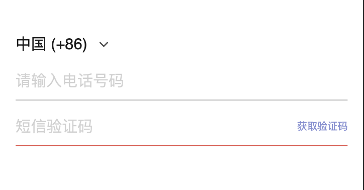
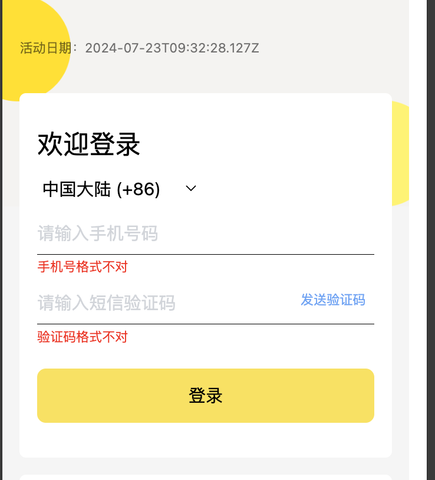

# 前端 Vue 表单校验

### 1、需求：实现一个通用 Vue 表单校验方案

手机验证码登录是比较常见的场景，如下：

<div align="center"> </img></div>

这里用这个场景来实现这个方案。

### 2、实现一个手机验证码的登录模块

接着[上一个项目](./前端tailwindcss页面实践.md)编码, 修改模块1 

```
<div class="relative mx-32 mt-32 px-32 py-64 bg-white rounded-12 text-24">
  <h1 class="text-48 mb-24">欢迎登录</h1>
  <select
    v-model="gsmInfo.gsmCode"
    placeholder="请选择地域"
    class="w-300 h-60 text-32 mb-12 outline-none"
  >
    <option
      v-for="item in gsmInfo.gsmOptions"
      :key="item.value"
      :label="item.label"
      :value="item.value"
    ></option>
  </select>
  <div class="mb-12 relative">
    <input maxlength="20" class="w-full h-80 border-b-2 border-black focus:border-red outline-none text-32 placeholder:text-gray-300" placeholder="请输入手机号码" />
    <p class="mt-8 text-red font-12">手机号格式不对</p>
  </div>
  <div class="mb-12 relative">
    <input maxlength="6" class="w-full h-80 border-b-2 border-black focus:border-red  outline-none text-32 placeholder:text-gray-300" placeholder="请输入短信验证码" />
    <span class="absolute top-20 right-16 text-blue-400">发送验证码</span>
    <p class="mt-8 text-red font-12">验证码格式不对</p>
  </div>
  <button class="w-full mt-32 h-100 bg-yellow-300 active:bg-yellow-400 rounded-16 text-32 text-normal" @click="loginSubmit"> 登录 </button>
</div>

<script lang="ts" setup>
import { reactive } from 'vue'
const gsmInfo = reactive({
  gsmCode: '+86',
  gsmOptions:[{
        key: '+852',
        value: '+852',
        label: '中国香港 (+852)',
    },
    {
        key: '+86',
        value: '+86',
        label: '中国大陆 (+86)',
    }
  ],
})
</script>
```
<div align="center"> </img></div>


### 3、表单校验方案

分析需求，罗列下，大概有以下。

- 1、手机号，验证码，需要校验非空，格式是否正确
- 2、手机号格式校验，不同的地域，规则不一样
- 3、发送验证码，只需要校验手机号OK，即可调用接口
- 4、登录接口，需要校验手机号，验证码2者的格式
- 5、校验不通过，提示红色错误文案，输入框变化，错误提示消失
- 6、基于安全因素，和成本。 发送验证码需要有 60 秒倒计时，且防止重复点击保护
- 7、用户行为数据上报，这里暂时不考虑
- 8、以上用 ts 实现，有类型推导功能。

先上代码
```
// template 代码
<div class="mb-12 relative">
  <input v-model="formData.phone" maxlength="20" class="w-full h-80 border-b-2 border-black focus:border-red outline-none text-32 placeholder:text-gray-300" placeholder="请输入手机号码" />
  <p class="mt-8 text-red font-12" v-if="formErrors.phone.error">{{ formErrors.phone.message }}</p>
</div>
<div class="mb-12 relative">
  <input v-model="formData.captcha" maxlength="6" class="w-full h-80 border-b-2 border-black focus:border-red  outline-none text-32 placeholder:text-gray-300" placeholder="请输入短信验证码" />
  <span class="absolute top-20 right-16 text-blue-400" @click="codeSend">发送验证码  {{ countNum == 0 ? '' : `: ${countNum}s`}}</span>
  <p class="mt-8 text-red font-12" v-if="formErrors.captcha.error">{{ formErrors.captcha.message}}</p>
</div>
<button class="w-full mt-32 h-100 bg-yellow-300 active:bg-yellow-400 rounded-16 text-32 text-normal" @click="loginSubmit"> 登录 </button>

// script 代码
interface IFormData {
  phone: string,
  captcha: string 
}
const validations:IFormValidation<IFormData> = {
    phone: {
        required: {
            value: true,
            message: '请输入手机号码'
        },
        phoneCN: {
            value: () => gsmInfo.gsmCode == '+86',
            message: '中国大陆手机号码不正确'
        },
        phoneHK: {
            value: () => gsmInfo.gsmCode != '+86',
            message: '中国香港手机号码不正确'
        }
    },
    captcha: {
        required: {
            value: true,
            message: '请输入短信验证码'
        },
        fixedNumber: {
            value: 6,
            message: '验证码错误，请重新输入'
        }
    }
}
const { formData, formErrors, handleSubmit } = useFormValidation<IFormData>(validations)
const { countNum, startCountDown } = useCountDown()
const codeSend = handleSubmit(async () => {
  startCountDown(60)
}, ['phone'])
const loginSubmit = handleSubmit(async () => {
    console.log('login submit')     
})
```

`useFormValidation` 代码实现

```
import { reactive, watch } from "vue"

// 内置的正则校验
const phoneCNRegExp = /^1[345789]\d{9}$/
const phoneHKRegExp = /^([6|9])\d{7}$/
const IdCNRegExp = /^[1-9]\d{5}(18|19|20)\d{2}(0[1-9]|1[0-2])(0[1-9]|[12]\d|3[01])\d{3}(\d|X|x)$/
const IdHKRegExp = /^[A-Z]{1,2}[0-9]{6}[A0-9]$/
const emailRegExp = /^\w+([\.-]?\w+)*@\w+([\.-]?\w+)*(\.\w{2,3})+$/

// 可支持的校验类型
type ValidationType =
    'required' | 'minLength' | 'maxLength' | 'fixedNumber' | 'phoneCN' | 'phoneHK' | 'IdCN' | 'IdHK' | 'email' | 'validation'

interface ValidationValue {
    value?: number | boolean | ((field?: string) => boolean),
    message: string | ((field?: string) => string)
}
type ValidationItem = {
    [key in ValidationType]?: ValidationValue
}
interface ValidationFun {
    value: (field?: string) => boolean,
    message: string | ((field?: string) => string)
}
type IValidationBuiltFun = {
    [key in ValidationType]: (value: any) => (field: string) => boolean
}
interface IFormError {
    error: boolean,
    message: string
}
export interface IFormOptions<T> {
    initFields?: Partial<T>
}
export type IFormValidation<T> = {
    [key in keyof T]: {
        [key in ValidationType]?: ValidationValue
    }
}
type IFormErrors<T extends Record<string, any>> = {
    [k in keyof T]: IFormError
}

const isEmpty = (value:unknown) => {
    if(typeof value == 'string'){
        return value.trim() == ''
    }
    return value == undefined || value == null
}
const checkFunc = (value: any | (() => any)) => {
    if (typeof value == 'function') {
        return value()
    } else {
        return value
    }
}

const ValidationBuiltinFunctions: IValidationBuiltFun = {
    required: (value) => (field: string) => !checkFunc(value) ? true : !isEmpty(field),
    minLength: (value) => (field: string) => !isEmpty(field) && field.trim().length >= value,
    maxLength: (value) => (field: string) => !isEmpty(field) && field.trim().length <= value,
    fixedNumber: (value) => (field: string) => new RegExp(`^\\d{${value}}$`).test(field),
    phoneCN: (value) => (field: string) => !checkFunc(value) ? true : phoneCNRegExp.test(field),
    phoneHK: (value) => (field: string) => !checkFunc(value) ? true : phoneHKRegExp.test(field),
    IdCN: (value) => (field: string) => !checkFunc(value) ? true : IdCNRegExp.test(field),
    IdHK: (value) => (field: string) => !checkFunc(value) ? true : IdHKRegExp.test(field),
    email: (value) => (field: string) => !checkFunc(value) ? true : emailRegExp.test(field),
    validation: (value: (field?: string) => boolean) => (field: string) => value(field)
}

export const useFormValidation = <T extends Record<string, any>>(validations: IFormValidation<T>, options?: IFormOptions<T>) => {
    const _fields = Object.keys(validations) as (keyof T)[]
    // reactive 不需要传入范型
    const _formFields = reactive(Object.fromEntries(_fields.map(item => [item, options?.initFields?.[item]]))) as T
    const _formErrors = reactive(Object.fromEntries(_fields.map(item => [item, { error: false, message: '' }]))) as IFormErrors<T>

    // 创建所以字段的，校验函数组
    const filterValidatorFunctions: Record<string, ValidationFun[]> = _fields.reduce((prev, field) => {
        const validation = validations[field]
        return {
            ...prev,
            [field]: Object.keys(validation).map((item) => {
                const { value = true, message } = validation[item as keyof ValidationItem]!
                return {
                    value: ValidationBuiltinFunctions[item as keyof ValidationItem](value), // Todo Type
                    message: checkFunc(message)
                }
            })
        }
    }, {})

    /**
     * @description 依此校验每个函数，全部通过返回 true , 不通过返回 false 
     * @param field 字段
     * @returns 
     */
    const validator = (field: string) => {
        // 获取校验函数组
        const functions = filterValidatorFunctions[field]
        let flag = true
        let index = 0
        // 依次校验
        while (!!functions[index] && functions[index].value(_formFields[field])) {
            index++
            // 成功就 +1
        }
        if (index != functions.length) {
            // 没有全部通过，取第一个没有通过的函数返回 message
            _formErrors[field].message = checkFunc(functions[index].message)
            _formErrors[field].error = true
            flag = false
        } else {
            // 全部通过
            _formErrors[field].error = false
            _formErrors[field].message = ''
        }
        return flag
    }

    /**
     * 监听字段修改，发生变换之后清楚error
     */
    _fields.forEach((field) => {
        watch(
            () => _formFields[field],
            (value, prevVal) => {
                if (value !== prevVal) {
                    _formErrors[field].error = false
                    _formErrors[field].message = ''
                }
            }
        )
    })
    /**
     * @description submit包装函数，默认校验所有的字段，也可以通过 fields 参数指定字段数组
     * @param submit 
     * @param fields 
     * @returns 
     */
    const handleSubmit = (submit: () => Promise<any>, fields?: Array<keyof T>) => {
        const validateFields = fields || _fields
        return async (...argv:any) => {
            let result = true
            validateFields.forEach(item => {
                const flag = validator(String(item))
                result = result && flag
            })
            return result ? await submit.apply(this, argv) : new Error(`validate ${validateFields.join(' ')} fail`)
        }
    }

    return { formData: _formFields, formErrors: _formErrors, handleSubmit }
}
```

`useCountDown` 实现 : 代码有个问题，不知你能不能看出来。

```
import { onUnmounted, ref } from 'vue'

export function useCountDown() {
    const countNum = ref(0)
    const countInterval = ref(0)

    const startCountDown = (num:number) => {
        countNum.value = Number(num)
        clearCountDown()
        countInterval.value = setInterval(() => {
            if (countNum.value === 0) {
                clearInterval(countInterval.value)
                countInterval.value = 0
                return
            }
            countNum.value--
        }, 1000)
    }

    const clearCountDown = () => {
        if (countInterval.value) {
            clearInterval(countInterval.value)
        }
    }

    onUnmounted(clearCountDown);

    return { countNum, startCountDown, clearCountDown }
}
```

### 4、总结

1、`formData`, `formErrors` 都是响应式，可以随意使用
2、`handleSubmit` 默认校验所有字段，也可以手动传入校验的依赖
3、内置了 手机号，邮箱，ID身份证的校验
4、校验规则，value 支持函数，动态规则只有在 value 为 `true`时才校验； `value: () => gsmInfo.gsmCode == '+86'`
5、支持 `validation`类型，自定义规则校验，value 为任意返回 `boolean` 的函数。
```
validation: {
    value: (value?:string)=>{
        return value ? !value.includes('-') : true
    },
    message: '无需连接符号'
}
```
6、一行代码防止重复提交
```
const preventReqMore = (fn, p = null) => (...argv) => p ? p : (p = fn(...argv).finally(() => (p = null)))
const codeSend = preventReqMore(handleSubmit(async () => {
  startCountDown(60)
}, ['phone']))
const loginSubmit = preventReqMore(handleSubmit(async () => {
    console.log('login submit')     
}))
```