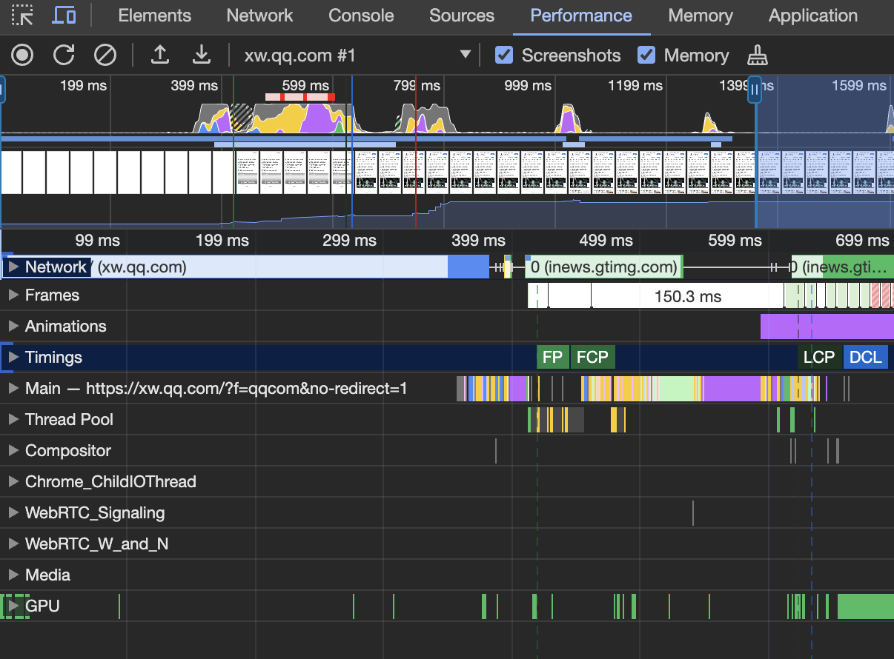
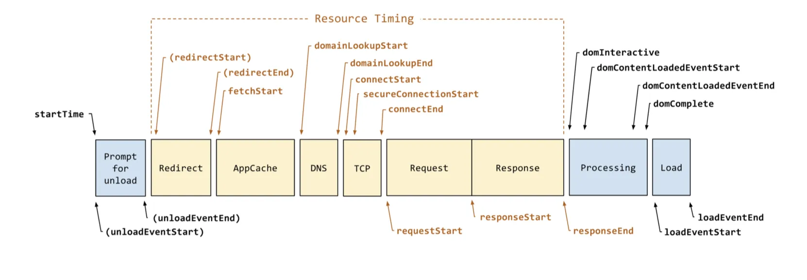
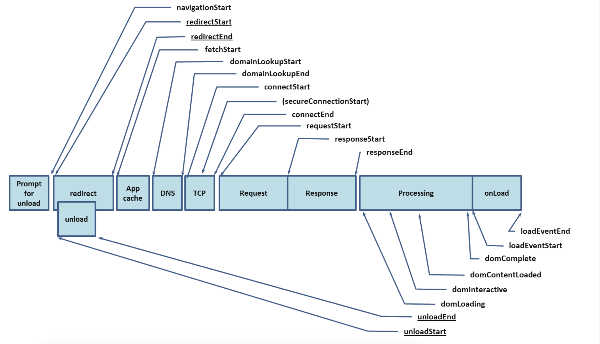
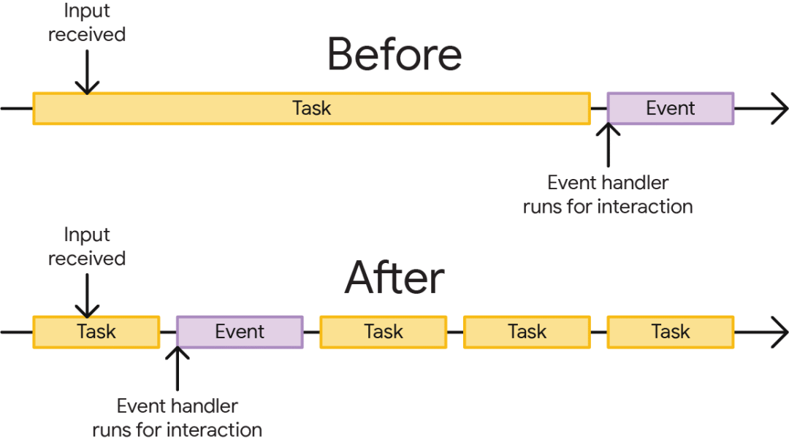

# 性能优化分析

> 前面谈到了[性能优化](性能优化.md), 那如何评判我们的性能优化的效果，以及检测哪些地方做的不够？

## 工具

### Lighthouse 

[lighthouse](https://developer.chrome.com/docs/lighthouse/overview?hl=zh-cn) 是一个用于诊断网页的工具，包括 性能、无障碍、渐进式、SEO 等方面，通过得分的方式来报告网页的质量。

使用方法：
- Dev Tools : 直接在 Dev Tools 中 lighthouse panel 勾选 Mode 、 Device 、Categories 之后点击 Analyze page load 即可
- lighthouse 扩展程序
- npm 包 
```
npm install -g lighthouse
lighthouse <url>
```
- PageSpeed Insights :  https://pagespeed.web.dev


### Performance Panel

chrome Dev Tools 中的 Performance panel 是一个专门检测性能的面板。里面有非常详细的数据，可以查看到性能相关的各个方面的数据

访问`xw.qq.com`之后，通过Performance面板跑的数据：如下
<div align="center"> </img></div>

最上面是 CPU , heap 数据， 下面是其他的指标

- Network : 可以看到资源的加载顺序以及其耗时
- Frames : 页面帧变化截图
- Main : 程序主进程（重要），可以用于分析 长任务
- Timings: DCL(DocumentContentLoad event) FCP LCP 等指标

### Performance Api

[Performance Api](https://developer.mozilla.org/en-US/docs/Web/API/Performance_API) 是一组用于衡量 web 应用性能的标准。 包含了 DOM 加载，渲染， 其他的资源加载过程 等指标，还可以自定义指标。

页面加载的过程分为多个阶段，如下

<div align="center"> </img></div>
<div align="center"> </img></div>

```
window.performance.timing: 
{
    "connectStart": 1711121440358,
    "navigationStart": 1711121440354,
    "secureConnectionStart": 0,
    "fetchStart": 1711121440358,
    "domContentLoadedEventStart": 1711121440526,
    "responseStart": 1711121440422,
    "domInteractive": 1711121440526,
    "domainLookupEnd": 1711121440358,
    "responseEnd": 1711121440428,
    "redirectStart": 0,
    "requestStart": 1711121440365,
    "unloadEventEnd": 1711121440425,
    "unloadEventStart": 1711121440425,
    "domLoading": 1711121440427,
    "domComplete": 1711121440592,
    "domainLookupStart": 1711121440358,
    "loadEventStart": 1711121440592,
    "domContentLoadedEventEnd": 1711121440526,
    "loadEventEnd": 1711121440594,
    "redirectEnd": 0,
    "connectEnd": 1711121440358
}
```

页面加载完了，`window.performance.timing`对下中会包含上图阶段对应的时间戳值，我们可以通过某些值的计算得出一些指标数据，如白屏时间，首屏时间等。

`performance.getEntries()` 包含了在页面加载过程中检测到所有指标， 包含资源加载， FP FCP 等多个指标。 可以通过过滤`entryType`来分析具体的指标数据。
```
VisibilityStateEntry {name: 'visible', entryType: 'visibility-state', startTime: 0, duration: 0}
PerformanceResourceTiming {initiatorType: 'link', nextHopProtocol: '', deliveryType: '', workerStart: 0, redirectStart: 0, …}
PerformanceResourceTiming {initiatorType: 'link', nextHopProtocol: '', deliveryType: '', workerStart: 0, redirectStart: 0, …}
PerformanceResourceTiming {initiatorType: 'link', nextHopProtocol: '', deliveryType: '', workerStart: 0, redirectStart: 0, …}
PerformanceResourceTiming {initiatorType: 'script', nextHopProtocol: 'h2', deliveryType: '', workerStart: 0, redirectStart: 0, …}
PerformanceResourceTiming {initiatorType: 'script', nextHopProtocol: 'h2', deliveryType: '', workerStart: 0, redirectStart: 0, …}
PerformanceResourceTiming {initiatorType: 'link', nextHopProtocol: '', deliveryType: '', workerStart: 0, redirectStart: 0, …}
PerformanceResourceTiming {initiatorType: 'link', nextHopProtocol: '', deliveryType: '', workerStart: 0, redirectStart: 0, …}
PerformanceResourceTiming {initiatorType: 'link', nextHopProtocol: '', deliveryType: '', workerStart: 0, redirectStart: 0, …}
PerformanceResourceTiming {initiatorType: 'script', nextHopProtocol: '', deliveryType: '', workerStart: 0, redirectStart: 0, …}
PerformanceResourceTiming {initiatorType: 'img', nextHopProtocol: '', deliveryType: '', workerStart: 0, redirectStart: 0, …}
PerformanceResourceTiming {initiatorType: 'img', nextHopProtocol: '', deliveryType: '', workerStart: 0, redirectStart: 0, …}
PerformanceResourceTiming {initiatorType: 'css', nextHopProtocol: '', deliveryType: '', workerStart: 0, redirectStart: 0, …}
PerformanceResourceTiming {initiatorType: 'css', nextHopProtocol: '', deliveryType: '', workerStart: 0, redirectStart: 0, …}
PerformanceResourceTiming {initiatorType: 'css', nextHopProtocol: '', deliveryType: '', workerStart: 0, redirectStart: 0, …}
PerformancePaintTiming {name: 'first-paint', entryType: 'paint', startTime: 2446.5999999940395, duration: 0}
PerformancePaintTiming {name: 'first-contentful-paint', entryType: 'paint', startTime: 2446.5999999940395, duration: 0}
PerformanceResourceTiming {initiatorType: 'iframe', nextHopProtocol: '', deliveryType: '', workerStart: 0, redirectStart: 0, …}
PerformanceResourceTiming {initiatorType: 'other', nextHopProtocol: 'h2', deliveryType: 'cache', workerStart: 0, redirectStart: 0, …}
```

## 关键指标 

### FPS : 页面刷新帧率

页面卡顿 ?  判断页面是否卡顿，就是计算页面 FPS , 60 左右是一个比较优的帧率，就是大约 16.5ms刷新一次页面。

如何计算 FPS ? `requestAnimationFrame` 是跟随着帧率执行代码，计算 1 秒 执行的次数就可以计算出帧率

如何减少卡顿 ? 减少卡顿就是避免长时间占用主进程，给予刷新页面留时间。由于 JS 的执行是单线程，如果长时间占用主线程，那么刷新页面，响应用户，就会滞后，进而导致卡顿。 解决方案：就是长任务拆解，将长任务拆解成多个短任务，将短任务分别置于任务循环中，在下个任务循环时执行。那么主线程就用空档来刷新页面，响应用户。

<div align="center"> </img></div>

如何分析？ 

实际过程中可以用 Chrome Dev Tool 的 Performance Panel 中的 Main 来分析长任务。 

也可以通过 `performance.getEntries()` 过滤 `entryType = 'longtask'`来分析

### 白屏时间 & 首屏时间

- 白屏时间： 请求页面到开始渲染时间, 可以用performance Api
```
const whiteScreenTime = performance.timing.responseStart - performance.timing.navigationStart;
```
- 首屏时间： 完全渲染第一屏的时间，第一屏会根据具体业务变化而变化，这里不是个固定值。一般可以有下面几种方式
    - DCL : domcumentContentLoad 事件触发时间 `performance.timing.domContentLoadedEventEnd`
    - LCP : FCP 是首次绘制的时间， LCP （largest-contentful-paint） 可以更准备的描述首屏时间
    - 监控节点高度： 使用 MutationObserver 来监听节点，如果节点的高度与大屏幕高度，则表示首屏已经渲染。
