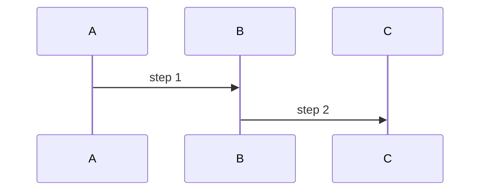
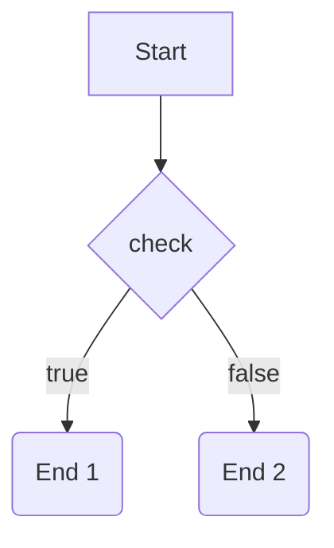

# mermaid

## 简介

[mermaid](https://mermaid.js.org/) 是一个图表工具，支持 时序图，类图，ER 图，状态图等

## 使用

基于 markdown 。vscode 安装插件 `Markdown Preview Mermaid Support`

- 时序图

```mermaid
sequenceDiagram
  participant A
  participant B
  participant C
  A->>B : step 1
  B->>C : step 2
```

- 流程图

```mermaid
flowchart TD
    Start --> Middle{ check }
    Middle --> | true | End1( End 1)
    Middle --> | false | End2( End 2)
```

- 类图
- ER 图
