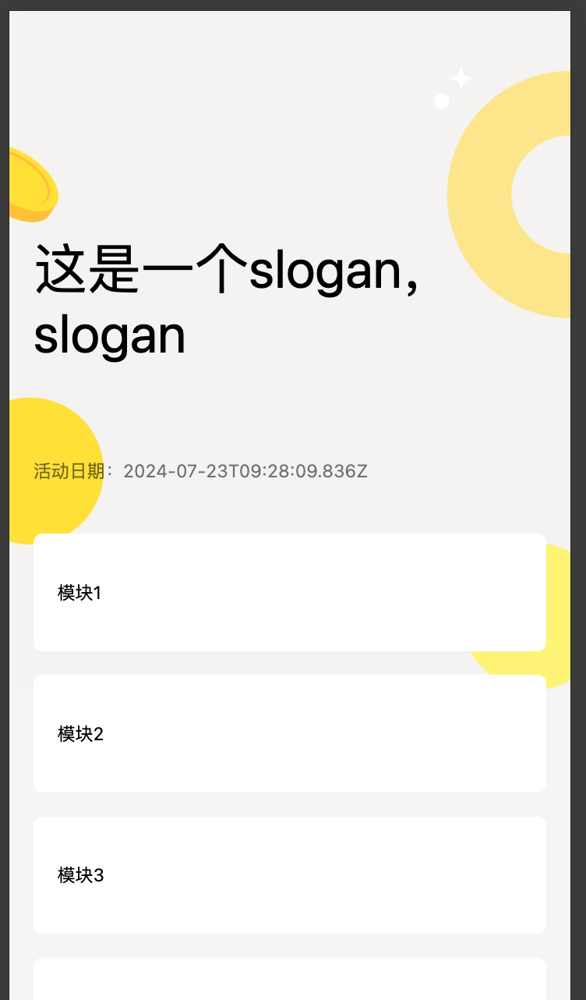
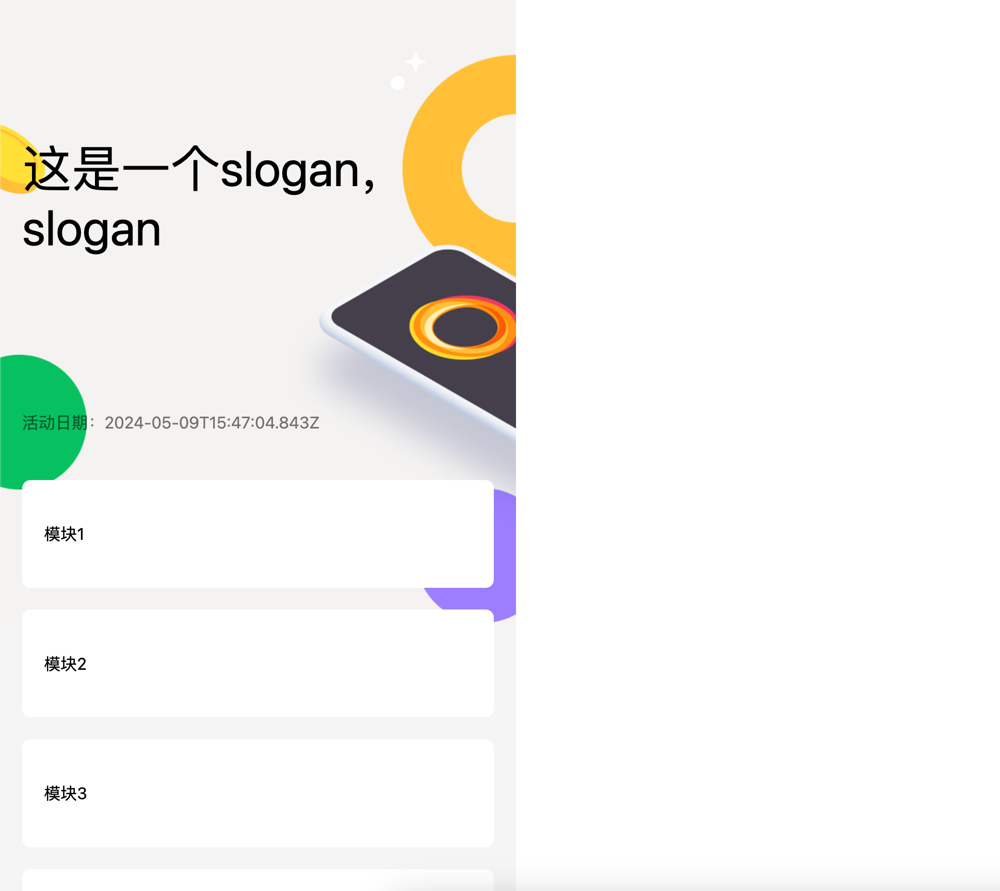

# 前端 tailwindcss 页面实践

响应式是前端页面必须要了解并掌握的能力，作为前端开发同学，我们从设计同学哪里接收设计稿，然后还原成一个具有响应式移动端页面。这里只针对移动端页面，不兼容PC端，在PC端仍显示移动端的瀑布流。接下来结合 tailwindcss 来实现下需求。

### 1、 技术栈

- 设计稿 ：figma 
- 构建工具 ：vite 5.2.0
- css : tailwindcss 3.4.3
- lib : vue 3.4.21
- 国际化 : 英/繁/简

### 2、使用 pnpm create vite 创建一个基础项目

官方步骤 https://www.tailwindcss.cn/docs/guides/vite#vue

- 创建一个 vite vue ts 基础项目
```
pnpm create vite  // 选择 vue typescript
```
- 安装 tailwindcss 相关依赖 
```
pnpm add -D tailwindcss postcss autoprefixer
```
- 创建 tailwind.config.js postcss.config.js 文件 , 用于配置自己的项目
```
pnpm tailwindcss init -p
```
-  在 tailwind.config.js 文件的 content 配置 tailwindcss 的入口, 用于扫描类名
```
export default {
  content: [
    "./index.html",
    "./src/**/*.{vue,js,ts,jsx,tsx}",
  ],
  theme: {
    extend: {},
  },
  plugins: [],
}
```
- 在 style.css 文件中添加 tailwind 内置的指令，用于导入 tailwindcss 提供的类名
```
@tailwind base;
@tailwind components;
@tailwind utilities;
```
- 修改 App.vue 文件，创建一个 长 100% 高 16 有颜色的长方形
```
<template>
  <div class="w-full h-16 bg-red-200"></div>
</template>
```
-  启动 vite 开发服务
```
pnpm run dev 
```

### 3、适配 设计稿 ，并适配多机型

- 配置 `tailwind.config.js` theme 

以我们团队设计稿为例， 以 `750px` 为最大宽度 ，长度，字体的单位都是 `px` 。为了适配设计稿，我们需要实现一些类来匹配。

比如 `w-100` 对应 `width: 100px` ; `h-200` 对应 `height: 200px` ; `text-24` 对应 `font-szie: 24px` ;

类似的还有 `top right botton left border-radius` 等， 长度需要覆盖2倍宽度 `750*2=1500` , 字体需要覆盖 `12-100` , 边框弧度需要覆盖 `750/2=375`。

除了长度，字体大小，还有颜色，字体类型(font-family)等

以下是 `tailwind.config.js` 配置 , 其中 颜色，字体 还有其他的需要根据团队视觉规范，项目要求，继续丰富。

**注意：这里在 theme.extends配置，属于扩展**

如果直接在 theme 中直接配置，虽然有同样效果，但是属于替换，覆盖 tailwindcss 自带的类名，不建议。

```
/** @type {import('tailwindcss').Config} */

const maxWidth = 750
const spacing = {};
for (let i = 0; i <= maxWidth; i++) {
  spacing[i] = `${i}px`;
}
const fontSize = {}
for (let i = 12; i <= 100; i++) {
  // 这里同时设置了1.2倍的行高
  fontSize[i] = [`${i}px`, `${i*1.2}px`];
}
const borderRadius = {}
for (let i = 1; i <= 750/2; i++) {
  // 这里同时设置了1.2倍的行高
  borderRadius[i] = `${i}px`;
}

export default {
  content: [
    "./index.html",
    "./src/**/*.{vue,js,ts,jsx,tsx}",
  ],
  theme: {
    extend: {
      // 适用 padding, margin, width, height, min-xxx ,max-xxx等
      spacing,
      // 适用 font-size
      fontSize,
      // 适用 border-radius
      borderRadius,
      // 适用 color, background-color, border-color
      colors: {
        // 这里的命令明确使用场景，颜色，深浅
        grayLight: 'rgba(0, 0, 0, 0.54)', // 通用灰色浅色
        bgGrayLight:'#f5f5f5',    // 背景灰色浅色
        linkBlueLight: '#828DD3', // 超链接蓝色浅色
      },
      fontFamily: {
        din: ['DIN'],
      },
    },
  },
  plugins: [],
}
```

- 简单的例子

写了一个简单活动的框架

```
<template>
  <div class="w-full bg-bgGrayLight pb-16 min-h-screen">
    <div class="relative w-full h-453 -mb-120 bg-no-repeat bg-cover bg-[url('./assets/headerBg.jpg')]">
      <div class="absolute w-300 top-100 left-16 text-36">
        这是一个slogan，slogan
      </div>
      <p class="absolute top-300 left-16 text-12 text-grayLight">活动日期：{{ new Date().toISOString() }}</p>
    </div>
    <div class="relative mx-16 mt-16 px-16 py-32 bg-white rounded-6">模块1</div>
    <div class="relative mx-16 mt-16 px-16 py-32 bg-white rounded-6">模块2</div>
    <div class="relative mx-16 mt-16 px-16 py-32 bg-white rounded-6">模块3</div>
    <div class="relative mx-16 mt-16 px-16 py-32 bg-white rounded-6">模块4</div>
  </div>
</template>
```

<div align="center"> </img></div>

- 适配 视觉稿 的尺寸

虽然实现了一个简单的活动，但是有个问题，就是长度，字体等单位是设计稿的一半，需要每次把设计稿中数字除以2，在来编写 css 类名，很麻烦。

同时为了兼容手机屏幕尺寸，采用 `rem` 单位来替代 `px` 。 为了方便，我们将设计稿的宽度`750px`设置为 `10rem` ， 对应的 `1rem` 就是 `75px`。 

这里需要引入一个`postcss`插件 `postcss-plugin-px2rem` 
```
pnpm add -D postcss-plugin-px2rem

// postcss.config.js 中添加  postcss-plugin-px2rem 配置 rootValue: 75
plugins: {
    tailwindcss: {},
    autoprefixer: {},
    'postcss-plugin-px2rem':{
        rootValue: 75
    }
},
```

设置完了之后，需要吧之前的代码中的 css 类名，乘以 2 ，保持跟设计稿同步，比如:背景头图高度是 `906px` 那么设置类名 `h-906` 即可，如下

```
<template>
  <div class="w-full bg-bgGrayLight pb-32 min-h-screen">
    <div class="relative w-full h-906 -mb-240 bg-no-repeat bg-cover bg-[url('./assets/headerBg.jpg')]">
      <div class="absolute w-600 top-200 left-32 text-72">
        这是一个slogan，slogan
      </div>
      <p class="absolute top-600 left-32 text-24 text-grayLight">活动日期：{{ new Date().toISOString() }}</p>
    </div>
    <div class="relative mx-32 mt-32 px-32 py-64 bg-white rounded-12">模块1</div>
    <div class="relative mx-32 mt-32 px-32 py-64 bg-white rounded-12">模块2</div>
    <div class="relative mx-32 mt-32 px-32 py-64 bg-white rounded-12">模块3</div>
    <div class="relative mx-32 mt-32 px-32 py-64 bg-white rounded-12">模块4</div>
  </div>
</template>
```

- 配置响应式 rem

为了在浏览器上使代码还原设计稿，还需要设置 rem , 需要设置 `html` 元素的 `font-size` 属性。 由于 我们把设计稿的宽度定义为 `10rem`, 那么 `document.documentElement.clientWidth == 10rem` 那么 `font-size`的值就是 `${document.documentElement.clientWidth/10}px`

在 main.ts 文件中添加 `font-size` 属性的设置即可。

```
const documentElement = window.document.documentElement
documentElement.style.fontSize = `${documentElement.clientWidth/10}px`

window.addEventListener('resize',()=>{
    documentElement.style.fontSize = `${documentElement.clientWidth/10}px`
})
```

**注意：** 由于 `font-size` 会继承 ，在需要展示内容的时候需要明确设置 `font-size` 属性。

- 避免 pc 端页面变形

pc 端由于 `documentElement.clientWidth` 很大，会导致页面变形。 由于市面上 ios android 手机屏幕宽度大概在 `320 - 500` 之间，这里将最大值设置为`500`。 

也可以通过校验 `navigator.userAgent.toLowerCase().includes('mobile')` 来判断，在 pc 浏览器下设置 `fontSize: 50px`。

```
// 修改之后代码。 
const documentElement = window.document.documentElement
documentElement.style.fontSize = `${Math.min(documentElement.clientWidth,500)/10}px`

window.addEventListener('resize',()=>{
    documentElement.style.fontSize = `${Math.min(documentElement.clientWidth,500)/10}px`
})
```

这里还需要给 `body` 设置一个宽度 `<body class="w-750">` 对应 `10rem` 作为满屏宽度

<div align="center"> </img></div>

上图在pc浏览器显示，右边空白，左边保持一个移动端的正常文档流

### 4、配置 多语言

如果页面需要在多语言环境运行，在英文环境下，由于英文翻译一般都会比简体长。 我们需要在 英文环境下修改一些元素的宽高，字体等。

这里类似 `tailwindcss` 的 `dark` 模式，创造一个 `en-GB` 模式类适配英文环境。 例如 `w-300 en-GB:w-500` 在 英文环境下 宽度 500 ，其他宽度 300

在 `tailwind.config.js` 文件中添加插件函数，通过 `addVariant` 创建一个变体（variant） `en-GB` 把所有 `en-GB:xxx` 类名，转义成 `.en-GB .en-GB:xxx` 的类选择器。 然后只要在 body 中添加 `en-GB` 类名即可 ` <body class="w-750 en-GB">`

一般有多语言需求的页面都会在 cookie 种上语言标记，例如 `en-GB` , 可以通过动态的方式获取，然后添加到 body 的 class 中即可， 但是给每个需要特殊处理的语言，调用`addVariant`添加变体。

```
// 配置 tailwind.config.js plugins 函数
plugins: [
    function ({ addVariant, e }) {
      addVariant('en-GB', ({ modifySelectors, separator }) => {
        modifySelectors(({ className }) => {
          return `.en-GB .${e(`en-GB${separator}${className}`)}`;
        });
      });
    },
],
```

```
// 添加 slogan 这里的变体  en-GB:top-300 表明英文环境下定位的 top 值是 300
<div class="absolute w-600 top-200 en-GB:top-300 left-32 text-72">
    这是一个slogan，slogan
</div>
```

通过 `pnpm run build` 构建生产版本，找到 css 文件内容 ， 编译结果跟我预期一致。

```
// 插件函数
modifySelectors(({ className }) => {
  return `.en-GB .${e(`en-GB${separator}${className}`)}`;
});
// 构建结果
.en-GB .en-GB\:top-300 {
    top: 4rem
}
```

当然我们也可以根据实际需求，创建其他的变体，比如，id 选择器 `#en-GB .en-GB:xxx` ； 子代选择器 `.en-GB>.en-GB:xxx` ；还有其他很多，构建符合自己需求的即可。

### 5、tailwincss 一些注意事项

- 1、负数单位 `-mt-100` 对应 `margin-top: "-100px"`
- 2、tailwindcss.config.js 中 theme 的配置，尽量使用 extends 方式来扩展，保留原始的类
- 3、为了方便，给 spacing color border-radius 配置了很多个类，生产环境仅会把使用到的打包，并不会大幅度增加css文件体积
- 4、因为第2点原因，不要使用动态类名，例如 ```:class="`w-${width}`"``` 。tailwindcss 不能扫描到 `w-${width}` 类名

