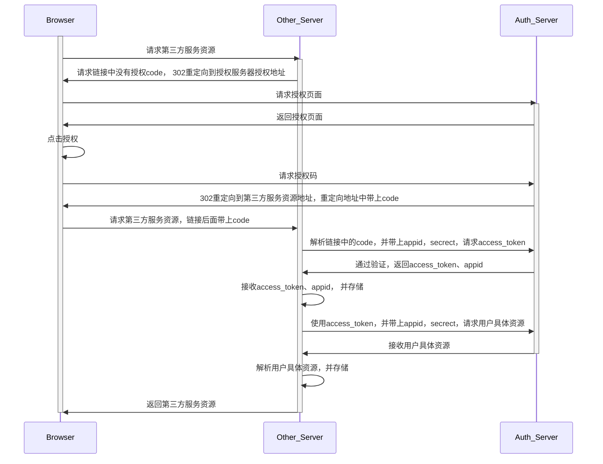

# 常见登陆授权认证模式

- 认证（Identification）： 就是认证用户是这个用户本人，一般是手机号，账户密码，等
- 授权（Authorization）：用户授权第三方访问用户的指定资源
- 鉴权（Authentication）： 对其身份和权利验证的过程，先认证->再授权->再鉴权

## CAS

[CAS：Central Authentication Service](https://zh.wikipedia.org/wiki/%E9%9B%86%E4%B8%AD%E5%BC%8F%E8%AE%A4%E8%AF%81%E6%9C%8D%E5%8A%A1)是一种针对 SSO (单点登录)的解决方案，属于解决认证问题；

### 1、场景

SSO 单点登录场景：多个不同域名服务均属于一个实体，提供了不同的服务，都需要登录认证，比较麻烦，构建一个集中认证服务，在认证服务登录之后，所有的业务服务均是登录状态，

### 2、概念

- CAS Server ：集中认证服务，提供登录操作，维持登录状态。
- CASTGC ：CAS Server 生成的 Ticket Granting Cookie 存储在自己服务的 Session 中，也保存在浏览器的 Cookie 中；**有一定有效期**，过期需要重新登录
- TGT：Ticket Grangting Ticket，CAS Server 中存储的用户登录的 ticket，以此判断用户是否登录，TGC 为 key 存储的 value 就是 TGT
- ST：登录成功之后，CAS 会重定向到业务 Server，并在连接后跟上 ?ticket=ST12345，业务 server 拿到 ST，跟 CAS 交互获取认证对象信息，之后，生成 sessionId，返回浏览器，存储在浏览器 cookie 和 业务 server session 中，后续业务 server 以此判断是否登录

业务 server：

- 先判断 sessionId 是否存在并有效 ？ 有效，执行具体业务 ：没有，下一步
- 再判断连接后面是否有 ST ? 有，请求 CAS : 没有，下一步
- 都没有重定向到 CAS 登录

CAS server:

- 先判断是否有 TGC，并判断 TGT 是否有效 ? 有效，重定向到业务 server，链接后面加上 ST : 没有，下一步
- 显示登录页面，校验数据
- 登录成功，重定向业务 server，链接后面加上 ST

### 3、流程图

<div align="center"> </img></div>

- CAS 登录之后会向浏览器设置 cookie（TGC）一般是固定时间，过期之后需要重新登录
- CAS 会校验 cookie 中是否有 TGC，再校验 TGC 对应的 TGT 是否有效，来判断是否登录
- 没登录就显示登录业务，登录之后就重定向带上 ST，ST 有效期一般较短，用于业务 server 请求 CAS server
- 业务 server 会向浏览器设置 sessionId，有一定实效性，每次校验之后会续期，如果过期则重定向 CAS server

### 4、单点登出

- 业务系统收到登出请求，重定向到 CAS server 登出界面
- CAS server 接收登出请求，清除 TGT
- 遍历登录过的业务 server，调用业务 server 的登出接口

## OAuth

OAuth(open authorization): 就是开放授权的意思，是一种允许第三方应用访问用户特定资源的解决方案。主要是给第三方服务的

### 1、基本概念

- access_token ：就是用户服务给第三方颁发的一个访问 Token，第三方在访问用户资源时，需要使用 Token
  - Token 是短期的，会失效的
  - Token 可以被用户服务器随时撤销
  - Token 有使用范围，不同权限的授权操作，用户服务颁发的 token 访问的资源不同
- refresh_token : 就是用来更新`access_token`的
- grant_type : 授权类型，`Authorization Code`,`Password`,`Client credentials`,`Implicit`

### 2、授权模式

- Authorization Code：授权码模式，最常用模式



- Implicit：隐藏模式，有些应用没有后台，access_token 存储在浏览器，不是很安全
- Password：密码模式，需要在第三方服务输入账户密码，风险很大
- Client credentials ：客户端模式，使用于没有前端的命令行应用

### 3、微信 OAuth 授权

以第三方应用获取用户信息为例：https://developers.weixin.qq.com/doc/offiaccount/OA_Web_Apps/Wechat_webpage_authorization.html#0

- 1、用户同意授权，获取 code，重定向到微信授权页面，用于获取 code
  ```
  https://open.weixin.qq.com/connect/oauth2/authorize?appid=wx807d86fb6b3d4fd2&redirect_uri=http%3A%2F%2Fdevelopers.weixin.qq.com&response_type=code&scope=snsapi_userinfo&state=STATE#wechat_redirect
  //返回数据结构
  {
    "access_token":"ACCESS_TOKEN",
    "expires_in":7200,
    "refresh_token":"REFRESH_TOKEN",
    "openid":"OPENID",
    "scope":"SCOPE",
    "is_snapshotuser": 1,
    "unionid": "UNIONID"
  }
  ```
- 2、通过 code 换取网页授权 access_token: 通过后台的方式，请求微信服务，获取 access_token ，appid
  ```
  https://api.weixin.qq.com/sns/oauth2/access_token?appid=APPID&secret=SECRET&code=CODE&grant_type=authorization_code
  ```
- 3、拉取用户信息(需 scope 为 snsapi_userinfo)：通过后台的方式，请求微信服务，获取用户的 userinfo
  ```
  https://api.weixin.qq.com/sns/userinfo?access_token=ACCESS_TOKEN&openid=OPENID&lang=zh_CN
  ```
- 4、如果 access_token 过期，需要刷新 refresh_token 来刷新 access_token，refresh_token 有效期 30 天，过期需要重新授权
  ```
  https://api.weixin.qq.com/sns/oauth2/refresh_token?appid=APPID&grant_type=refresh_token&refresh_token=REFRESH_TOKEN
  ```
- 5、验证 access_token 是否有效
  ```
  https://api.weixin.qq.com/sns/auth?access_token=ACCESS_TOKEN&openid=OPENID
  ```

## JWT

JWT(Json Web Token)：是一种将 Token 完全存储在客户端的一种技术方案，服务端无状态，只是验证生产和验证 JWT。

### 1、原理

服务器验证之后生成一个 JSON 对象，包含用户信息，过期时间等。为了防止被篡改，还会进行加密操作。后面的身份验证都是对这个对象的验证，这样服务就成了无状态了，方便扩展。

### 2、数据结构

JWT 就是由 3 个部分加上`.`组成（`header.payload.signature`)的字符串

- Header: 是一个 json 对象，描述 JWT 的元数据

```
{
  "alg": "HS256",  //签名算法
  "typ": "JWT"  //token类型，通用JWI
}
```

- Payload: 是一个 json 对象，是用来存储数据。官方提供了这 7 个数据，还可以加上自己的私有数据，不要放入用户的隐私数据

```
{
  iss: "(issuer)：签发人"
  exp: "(expiration time)：过期时间"
  sub: "(subject)：主题"
  aud: "(audience)：受众"
  nbf: "(Not Before)：生效时间"
  iat: "(Issued At)：签发时间"
  jti: "(JWT ID)：编号"
}
```

- Signature: 是对上面 2 个数据的签名，防止篡改，需要加入 secret。算法如下

```

HMACSHA256(

  base64UrlEncode(header) + "." +

  base64UrlEncode(payload),

  secret)
```

### 3、优缺点

- 简单方便，服务器无需维护 session，无状态，方便扩展
- 有效使用 payload 数据可以减少数据库查询
- 由于服务器没有存储，所以无法废除某个 JWT，或者修改权限，只能等等 JWT 过期。除非再根据 JWT 部署其他逻辑

## 二维码扫描验证
